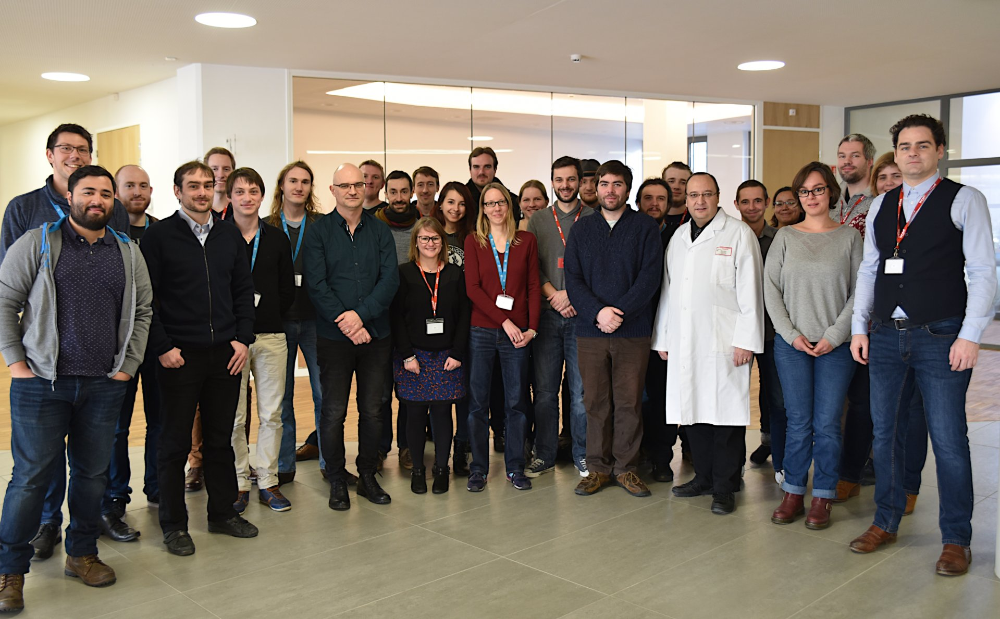
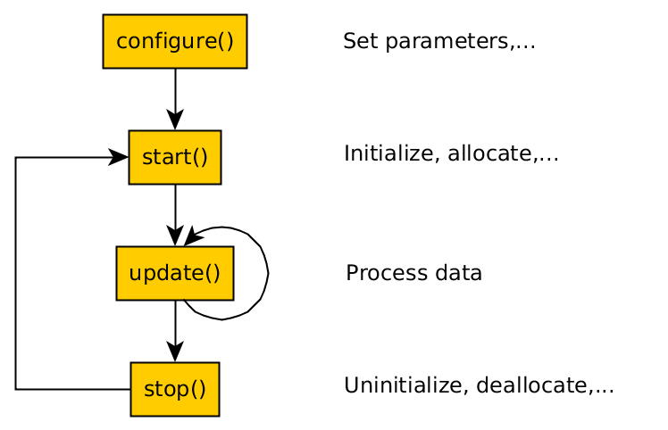
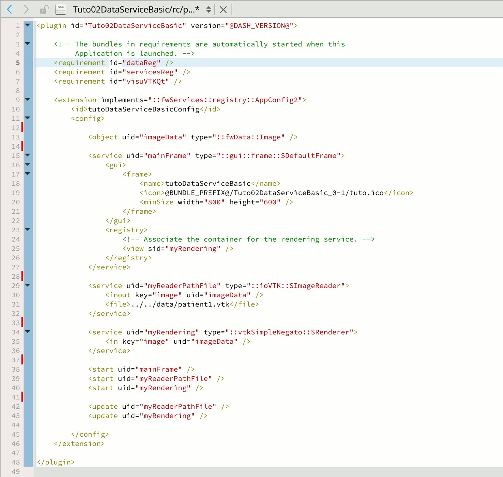
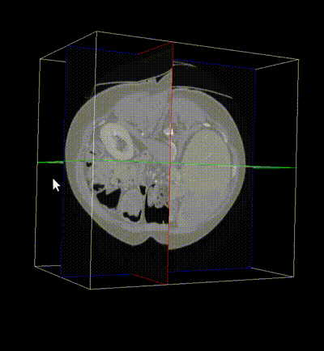
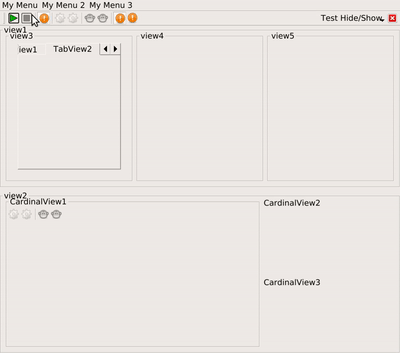
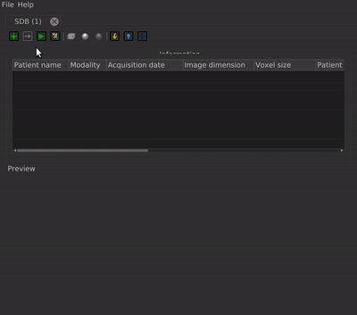
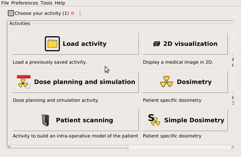

:title: Logiciel de réalité virtuelle et augmentée avec FW4SPL
:data-transition-duration: 1250
:author: Flavien Bridault
:description: Logiciel de réalité virtuelle et augmentée avec FW4SPL
:keywords: presentation
:css: css/presentation.css
:skip-help: true

----

:id: circle-no-background

|
|
|
|

Logiciel de réalité virtuelle et augmentée avec FW4SPL.
============================================================

**Flavien Bridault**

*Hacking Health Camp - Strasbourg, 17th March 2017*

----

:data-x: r0
:data-y: r1700
:data-rotate-z: 90
:class: text-small

Few words about me
====================

Background
*******************
- Phd. Thesis in Computer Graphics (2007)
- Senior programmer in the Video games industry (2008-2013)
    - Low-level programming
    - Graphics programming
    - XBox360, PS3, PC

Research engineer at IRCAD (since 2014)
***************************************
- VR/AR applications development
- FW4SPL (in-house software framework) enhancements, focus on simplicity and productivity
- Graphics programming

----

Overview
==================

- Philosophy
- Features and applications
- How to use and contribute

----

:class: centered
:data-scale: 2

Philosophy
==================

----

:data-scale: 1
:class: centered

FW4SPL
*******
=
**
*"Framework For Software Production Line"*

----

- Started in 2004
- OpenSource since 2009 (LGPL license)

----

Motivation
============

Create and maintain a range of applications
********************************************
- code sharing
- same look and feel
- follow guidelines

Target application
*******************
- beyond the small research prototype
- data storage/communication
- hardware support
- robustness
- productivity

----

:data-x: r30
:data-y: r200
:data-scale: 0.5

----

:data-x: r-30
:data-y: r-200
:data-scale: 1

----

:data-x: r0
:data-y: r1700
:data-scale: 1

Architecture
=====================

The three main concepts
*************************
- Components
- Objects/Services
- Signal/Slot communication

Technology
*************
- Written in C++
- Link with open source libraries (boost, Qt, VTK, ITK, OpenCV, PCL...)
- Build with CMake
- Cross-platform : Windows, Linux, MacOSX and Android

----

Components
=====================

- Also called *Bundle* (in OSGi)
- Dynamic library, loaded on demand
- Group services, by theme and/or by dependency
- Examples: **ioVTK**, **uiImageQt**

----

Objects/Services
=====================

- Only one functionality (Read, Segment, Visualize...)
- A service work on a set of data
- Class of services (reader, operator, renderer)
- State pattern
- Can be launched on any thread

.. note::
    - decouple data from functionality
	- update can be repeated

----

:class: centered
:data-x: r-500
:data-y: r0
:data-scale: 0.8

.. note::
	- transitions, on ne peut pas passer de configure à stop
	- We need to store data into it

----

:data-x: r0
:data-y: r1700
:data-scale: 1

Signal/Slot communication
==========================

Signals/Slots (inspired by Qt)
********************************
- Data -> Service
- Service <-> Service

Slot call
***********
- synchronous
- asynchronous

:class: centered

.. image:: images/sigslot.png
           :width: 100%
           :align: center

----

XML configurations
=====================

- Most used interface to write applications in FW4SPL.
- Static description of applications.
- Allow to share data and services setups.

----

:data-scale: 0.75
:data-x: r-400
:data-y: r0

----

:class: centered
:data-scale: 2
:data-x: r0
:data-y: r2700

Features and applications
===========================

----

:data-scale: 1
:data-y: r2700

Data
======

Image (1D/2D/3D)
*******************
- DICOM: CT, dynaCT and MRI
- VTK
- ITK
- OpenCV

Mesh
*******
- DICOM: surface segmentation
- VTK
- PCL

High-efficiency in-house data format
*************************************
- Based on JSON(z) + zipped buffers
- Version managment
- Allow safe data structure modifications

----

:data-x: r-600
:data-y: r0

----

:data-x: r0
:data-y: r1700

User interface
================

Based on Qt
*************
- Classic frames/menus/toolbars/widgets/layouts
- Style sheet support (CSS)

----

:data-x: r-650
:data-y: r0
:class: noh1

User preferences
*******************
- User interface settings (size, location, etc...)
- Store file dialog last paths
- Set URL, port, etc...

----

:data-x: r0
:data-y: r1700

Activities
================

- Application configuration available in xml
- Activity wizard/serialization/sequencing

----

Visualization
======================

- 2D/3D generic scene (VTK/Qt)
- 2D Multi-Planar Reconstruction
- 3D meshes with optional 3D orthogonal MPR
- 3D volume rendering with editable and transfer func
- 2D or 3D widgets synchronization
- VTK/Ogre
- MPR curved
- Measuring tool features and landmarks

----

Network
======================

- openIGTLink (un exemple !)
- DICOM PACS(DCTMK, ODIL in progress...)
- MIDAS communication

----

Video
==========

- Webcam support (QTMultimedia)
- Video file/streaming support (QTMultimedia/VLC)
- Kinect/Sense/RealSense support (not yet open :( )

----

main repository :
*********************
- Embedded python
- Around 15 tutorials
- VR-Render

----

others repositories :
*************************
- 4D synchronization - timeline

----

:class: text-small

Augmented-reality features
============================

- AR with OpenCV, Aruco, ARAM
- Tracking, Calibration, Registration, ...
- Marker tracking
- Mono/stereo

----

Soft-body physics
=====================

- Bullet
- Sofa

----

:class: centered
:data-scale: 2

How to use and contribute
===========================

----

:class: text-small

:data-scale: 1
:data-x: r0
:data-y: r1500

Getting started
==================================================================

Basics
******************

- GitHub `<http://fw4spl-org.github.io>`_
- Documentation `<http://fw4spl-doc.readthedocs.org>`_
- Developper blog `<http://fw4spl-org.github.io/fw4spl-blog>`_
- #fw4spl on irc.freenode.net and `<http://fw4spl.slack.com>`_

Source
********************

- Github : `<https://github.com/fw4spl-org>`_
- Latest stable version : 11.0.4
- Older version have been used successfully in a CE/FDA marked application.

Others
*************

- Repositories : fw4spl, fw4spl-ext, fw4spl-ar, fw4spl-ogre, ...
- Debian Integration (Previous stable version 0.9.2)

----

:class: text-small
:data-x: r0
:data-y: r1500

Future
===========================

- Simplify API and code
- Improve documentation (towards ISO13485 support)
- **Improve installation process** (repository cloning, docker, binaries...)
- Enhance C++11 support (C++14 ?)
- Enhance embedded python
- Enhance unittests
- Support for **web** development
- User interface markup language
- New threading and GPU technics

----

:class: centered
:data-y: r1500

Thank you !
=============

fw4spl at gmail.com

fbridault at ircad.fr

|
|

	Presentation made with Hovercraft_

.. _Hovercraft: https://github.com/regebro/hovercraft
