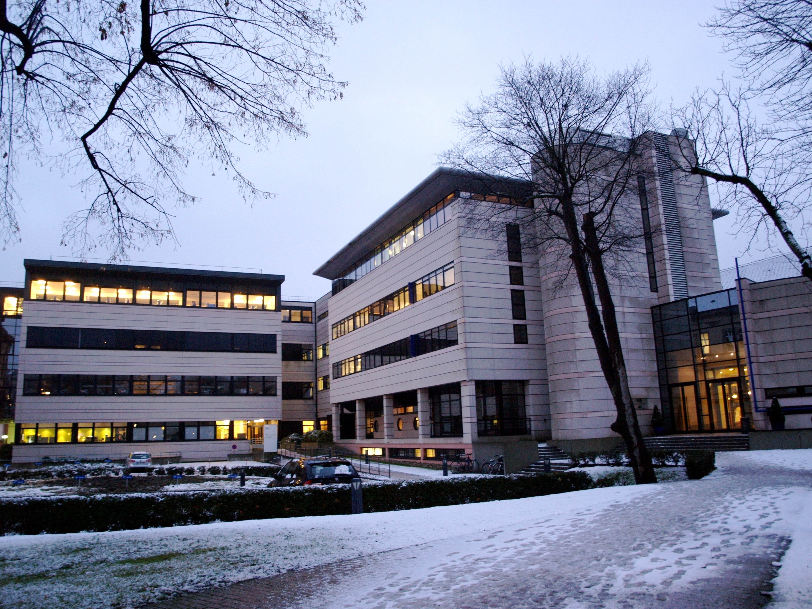
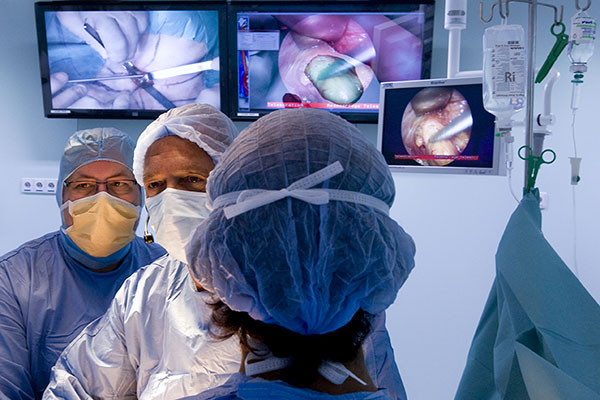
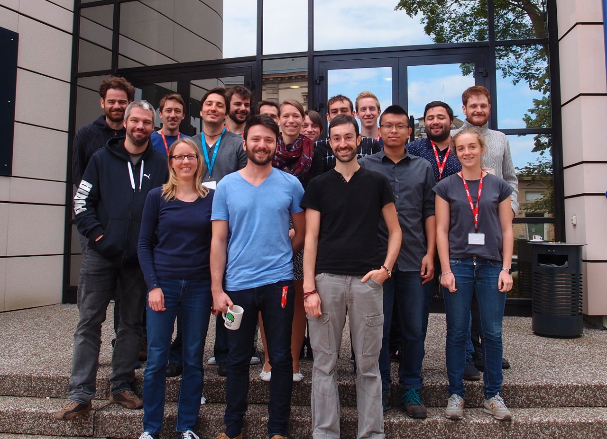
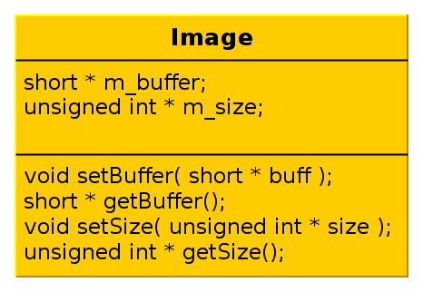
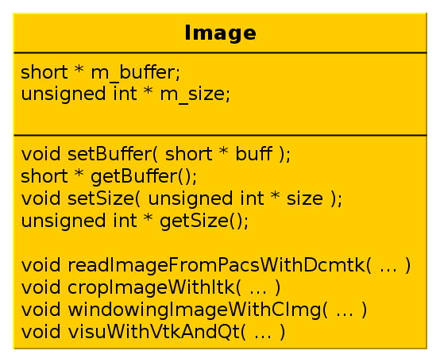
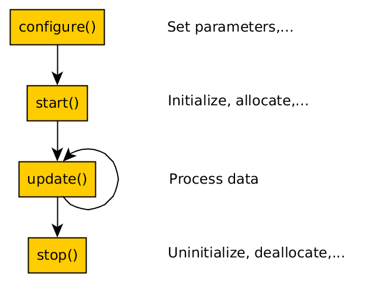
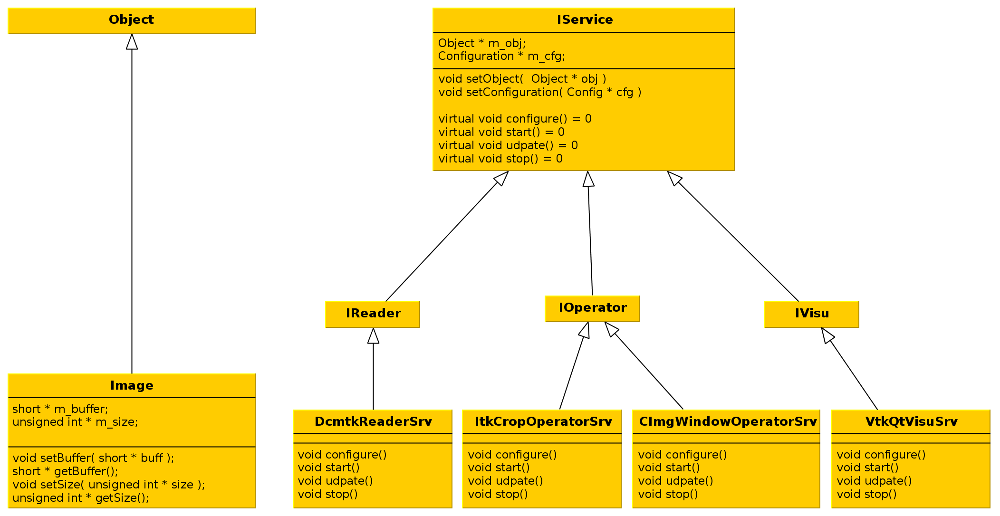
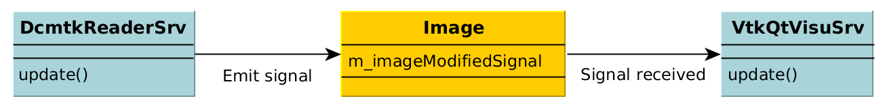

:title: FW4SPL, a framework for applications based on medical imaging
:data-transition-duration: 1250
:author: Flavien Bridault
:description: Basic hovercraft example
:keywords: presentation
:css: css/presentation.css
:skip-help: true

.. role:: main-color
.. role:: big-bold
.. role:: bold-color
.. role:: big-bold-color
.. role:: funny-font

.. role:: mail

----

:id: circle-no-background

|
|
|

FW4SPL, a framework for applications based on medical imaging. 
==================================================================

|

**Flavien Bridault**

*RMLL 2015, Beauvais, Wednesday, 8th 2015*

----

:data-y: r1500
:data-rotate-z: 90
:class: ircad
           
IRCAD
=================

           
- Institut de Recherche contre les Cancers de l'Appareil Digestif
- Created by Jacques Marescaux in 1994
- Training center/Research

      
----
           
IHU
=================

     

           
Mini-invasive surgery guided by image

.. note::
    - Institute located next to IRCAD...
    
    
----

:data-y: r1500

Presentation purpose
==================================================================

- Why IRCAD R&D team has developed FW4SPL ?
- Explain the design
- Show the main features
- Help to start developing

----

FW4SPL meaning
===============

- FrameWork for Software Production Line
- Nickname: *F4S* -> *Forces* [fɔʁsjz]

----

:class: square-background
:data-y: r1500

Outline
==================================================================

- *Introduction*
- Object/Service approach
- Communication
- Component based approach
- Discussion
- Getting started

.. note::

    - Introduction - 5min
    - Object/Service approach - 10 min
    - Communication -5min 
    - Component based approach - 5min
    - Getting started - 10min
    - Conclusion - 5min

----

:id: ircad-context

IRCAD context
=================

.. note::
    - At IRCAD, we make prototypes/PoC of software based on medical imaging
    - Our data is the patient
    - Historically we have worked on different steps of the image process
    
----

:data-x: r-300
:data-y: r-300
:data-scale: 0.4

.. raw:: html

       
Viewer/Segmentation

       <video width="800" height="600" controls>
          <source src="../git/RMLL/videos/VRMedNegato2D3D.mp4" >
          Your browser does not support the video tag.
       </video>

----

:data-x: r-300
:data-y: r100
      

.. raw:: html

       
Planning

       <video width="800" height="600" controls>
          <source src="../git/RMLL/videos/TeaserVisiblePatient2012.mp4" >
          Your browser does not support the video tag.
       </video>

----

:data-y: r400

.. raw:: html

       
Simulation

       <video width="800" height="600" controls>
          <source src="../git/RMLL/videos/digitalTrainersSimu1.mp4" >
          Your browser does not support the video tag.
       </video>
       
       
----

:data-y: r100
:data-x: r300

.. raw:: html

       
Augmented reality

       <video width="800" height="600" controls>
          <source src="../git/RMLL/videos/rdARinteractive1.mov" >
          Your browser does not support the video tag.
       </video>
       
----

:data-x: r-200
:data-y: r-300
:data-scale: 1.2

----

:class: text-small
:data-y: r1500

IRCAD R&D team
=================

- Researchers (3)
- Engineers (7)
- Phd. students (3)
- Trainees (6)
- Internships (4) 
   
.. note::
    The team who work on these softwares contains...

----

IRCAD R&D needs
=================

- Quick development/prototyping on different plaforms
- Maximal source code re-using
- Intensive use of open source libraries (boost, Qt, VTK, ITK,...) 
- Trainees/phd (students) works integrated but fragmented
- Facilitate collaborations (source code available or not)

.. note::

    - software/prototype - Windows, OSX, Linux, Android, IOs
    - sample with image filter, something...
    
----

FW4SPL characteristics
===========================

- Object/services design
- Component based (inspired by OSGi_)
- Developed in C++
- Applications built in XML
- Multi platforms (Windows, Linux, OSX, Android)
- Dependencies on many open source libraries
- Licensed under LGPL

.. _OSGi: http://www.osgi.org

.. note::
    XML, not common to build applications
    
----

FW4SPL history
=================

- 2004-2007 : fw4spl project
- 2007-2009 : **VRRender** 0.7 (free)
- 09/2009 : fw4spl became open-source (LGPL)
- 2010 : PoC **Sofa** (Altran-Est)
- 2011 : PoC **Kinect** (Altran-Est), VRRender 0.9 (open)
- 2013 : Creation of the FW4SPL board

.. note::
	- Sofa: biomechanical engine

----

:data-x: r-450

- 2014 : Switched to **CMake** for building
- 2014 : Migrated to **GitHub** and **Bitbucket** repositories
- 2014 : Started **Android** support
- 2015 : Created a blog for developers

.. note::

    - VRRender: mesh/image viewer - mettre une image !

----

:class: square-background
:data-x: r2000
:data-rotate-z: r90

Outline
==================================================================

- Introduction
- *Object/Service approach*
- Component based approach
- Communication
- Discussion
- Getting started

.. note::

    - Introduction - 5min
    - Object/Service approach - 10 min
    - Component based approach - 5min
    - Communication - 10min 
    - Getting started - 5min
    - Conclusion - 5min

----

:data-x: r1500

What is the Object/Service approach ?
==================================================================

----

:data-x: r1500

Classic approach
====================

- an object (i.e. an image) is represented by a class.

----

:class: centered
:data-y: r250
:data-scale: 0.5

----

:data-scale: 1
:data-y: r250

- this class contains all functionalities working on the object (reading, writing, visualization,image analysis, ...)

----

:class: centered
:data-y: r250
:data-scale: 0.5

----

:data-scale: 1
:data-x: r1500

Limits of this approach
============================

- Too many methods in the class, hard to maintain 
- Many dependencies required even if you only need a single method.
- Collaborative work harder

Solution
***********
1. Split data and functions
2. Put them in different files
3. Put them in different libraries

.. note::

    - Too many functions, if team continue to add functions
    - Many dependencies required (itk,vtk,qt,dcmtk,...) even if you need just cropping an image
    - Everyone work on the same file
    - Put them in different files and libraries

----

Service
============================

- Only one functionnality (Read, Crop,...)
- Class of services (IReader, IOperator, IVisu)
- Basically an helper/observer, but can be instantiated
- State pattern

.. note::
	- constat pour chaque fonctionnalité il faut toujours configurer, initialiser
	- update on peut répéter et arrêter

----

:class: centered
:data-y: r450
:data-scale: 0.8

	
.. note::
	- transitions, on ne peut pas passer de configure à stop
	- We need to store data into it

----

:class: centered
:data-scale: 1
:data-x: r1500
:data-y: r-200

*Service approach example*

       
----

:data-scale: 0.15
:data-x: r-50
:data-y: r360

DcmtkReaderSrv
================
    
- setConfiguration(cfg) : set a string that represents the url on network
- configure() : verify if url is ok
- start() : do nothing
- update() : read the data ( equivalent to **readImageFromPacsWithDcmtk()** )
- stop() : do nothing

----

:data-x: r165

ItkCropOperatorSrv
===================
    
- setConfiguration(cfg) : set a cropping region
- configure() : verify if the cropping region is valid
- start() : do nothing
- update() : compute the cropping on image and set the new data (equivalent to **cropImageWithItk** )
- stop() : do nothing

----

:data-x: r360

VtkQtVisuSrv
===================
    
- setConfiguration(cfg) : set title and window size
- configure() : verify if the screen support this size
- start() : initialize Qt frame and vtk pipeline and show the frame
- update() : check the buffer, if it has changed, refresh the vtk pipeline
- stop() : destroy vtk pipeline and uninitialize Qt frame.

.. note::
    
    - setConfiguration(cfg) : set title and window size
    - configure() : verify if the screen support this size
    - start() : initialize Qt frame and vtk pipeline and show the frame (image is not shown if image buffer is null )
    - update() : check if the buffer has be changed, if true, refresh the vtk pipeline to show negato
    - stop() : destroy vtk pipeline and uninitialize Qt frame.

----

:data-x: r-260
:data-y: r160
:class: text-small

Program
===================

.. code:: c++

    Object* img = new Image();
    IService* visu = new VtkQtVisuSrv();
    visu->setObject( img );
    visu->setConfiguration( visuParam );
    visu->start();
    
    IService* reader = new DcmtkReaderSrv ();
    reader->setObject( img );
    reader->setConfiguration( readerParam );
    reader->start();
    reader->update();
    visu->update();
    
    IService* op1 = new ItkCropOperatorSrv ();
    op1->setObject( img );
    op1->setConfiguration ( cropParam );
    op1->start();
    op1->update();
    visu->update();
    
    IService* op2 = new OpenCVWindowOperatorSrv();
    ...

.. note::
    - And now ? What's the next step
    
----

:data-y: r600
:data-scale: 1

Last step
======================================

Application description in XML
*******************************

- Grab all objects and services from a file
	- Launcher
- Services and objects types are registered dynamically
- Instances are created by a factory

----

:data-x: r1500
:class: text-small

XML configuration file
======================================

.. code:: xml

    <object type="::fwData::Image">

        <service uid="myFrame" impl="DefaultFrame" type="IFrame" >
            <gui>
                <frame>
                    <minSize width="800" height="600" />
                </frame>
            </gui>
            <registry>
                <view uid="myVisu" />
            </registry>
        </service>

        <service uid="myVisu" impl="vtkSimpleNegatoRenderer" type="IRender" />
        
        <service uid="myReader" impl="VtkImageReader" type="IReader" >
            <filename path="./TutoData/patient1.vtk"/>
        </service>

        <start uid="myFrame" />
        <start uid="myVisu"/>
        <start uid="myReader"/>

        <update uid="myReader"/>    <!-- Read the image on filesystem -->
        <update uid="myVisu"/>      <!-- Refresh the visu -->

    </object>
    
----

Problem
==============

Now the reader must be called by UI
****************************************************

- We can no longer call **update()** of the visualization from the xml
- *How to automate the call ?*

----

:class: square-background
:data-y: r1500
:data-rotate-z: 90

Outline
==============================

- Introduction
- Object/Service approach
- *Communication*
- Component based approach
- Discussion
- Getting started

.. note::

    - Introduction - 5min
    - Object/Service approach - 10 min
    - Communication -5min 
    - Component based approach - 5min
    - Getting started - 10min
    - Conclusion - 5min
    
----

:data-y: r1500

Communication
===================

- *Signals/Slots* (inspired by Qt)
    - Data -> Service
    - Service <-> Service
- Replace the old messaging system
- Only mechanism in latest version

----

Features
===================

- Signal emission is either:
    - synchronous
    - asynchronous
- A slot can be executed on a specific worker thread

----

:class: centered

           
|
|
|
|
|
|

----

:class: text-small
:data-x: r-10
:data-y: r-150
:data-scale: 0.6

.. code:: c++

    void DcmtkReaderSrv::update()
    {
        // Load an image using dcmtk
        Dcmtk::Image img;
        ... 
        
        Image* img = this->getObject<Image>();
        
        // Convert dcmtk image data in our format
        img->createImage(img, size);
        
        // Emit the signal "modified"
        Signal* sig = img->signal("modified");
        sig->asyncEmit();
    }
      
----

:class: text-small
:data-x: r-40
:data-y: r350

.. code:: xml

    <object uid="imageUID" type="::fwData::Image">
        
        ...

        <service uid="myVisu" impl="vtkSimpleNegatoRenderer" type="IRender" />
        
        <service uid="myReader" impl="VtkImageReader" type="IReader" >
            <filename path="./TutoData/patient1.vtk"/>
        </service>
        
        <connect>
            <slot>imageUID/modified</slot>
            <signal>myVisu/update</signal>
        </connect>

        <start uid="myFrame" />
        <start uid="myVisu"/>
        <start uid="myReader"/>
            
    </object>
    
----

:class: square-background
:data-y: r1500
:data-rotate-z: 180

Outline
================================

- Introduction
- Object/Service approach
- Communication
- *Component based approach*
- Discussion
- Getting started

.. note::

    - Introduction - 5min
    - Object/Service approach - 10 min
    - Communication -5min 
    - Component based approach - 5min
    - Getting started - 10min
    - Conclusion - 5min
    
----

:data-x: r-1500

Component based approach
========================

Examples
***********

- Eclipse,...

Benefits
***********

- Code reuse without recompiling
- Easier support
- Easier collaborative work
- To split code and to improve external dependencies management (VTK, ITK, Qt,...)

.. note::
    - Reuse code in another application, without recompiling your program
    - Easier support EXAMPLE correction of bug
    
----

Component in FW4SPL
========================

- Also called *Bundle*
- Group services, by theme and/or by dependency
- Loaded dynamically
- Examples: 
    - **ioITK**: reading/writing image or mesh data with ITK formats
    - **uiImageQt**: user interface controls using Qt to manipulate images

----

Content of a Bundle
========================

- Xml description file : **plugin.xml**
- Dynamic libraries ( .so, .dll, .dylib)
- Other shared resources ( icons, sounds, ... )

.. note::
    - When a Bundle is compiled
    - Xml description file ( plugin.xml ) to describe the content of the dynamic library

----

:class: text-small

Extract of plugin.xml (ioITK)
==============================

.. code:: xml

    <plugin id="ioITK" class="ioITK::Plugin">
        <library name="ioITK" />

        <requirement id="io" />
        <requirement id="gui" />

        <extension implements="::fwServices::registry::ServiceFactory">
            <type>::io::IReader</type>
            <service>::ioITK::InrImageReaderService</service>
            <object>::fwData::Image</object>
            <desc>Inrimage Reader (ITK/Ircad)</desc>
        </extension>

        <extension implements="::fwServices::registry::ServiceFactory">
            <type>::io::IWriter</type>
            <service>::ioITK::InrImageWriterService</service>
            <object>::fwData::Image</object>
            <desc>Inrimage Writer (ITK/Ircad)</desc>
        </extension>

        <extension implements="::fwServices::registry::ServiceFactory">
            <type>::io::IWriter</type>
            <service>::ioITK::JpgImageWriterService</service>
            <object>::fwData::Image</object>
            <desc>Jpeg Writer (ITK)</desc>
        </extension>
        ...
    </plugin>

.. note::
    - This shows how to register services in the factory
	- This helps to load bundles dynamically
    - Don't talk about extension points
    
----

Bundles in application
========================

*profile.xml*

- Input file for the launcher
- Describe which bundles to use

----

:data-y: r-320

:class: text-small

.. code::

	<profile name="TestApp" version="0.1.0">

		<activate id="dataReg" version="0-1" />

		<activate id="gui" version="0-1" />
		<activate id="guiQt" version="0-1" />

		<activate id="io" version="0-1" />
		<activate id="ioVTK" version="0-1" />

		<activate id="media" version="0-1" />

		<activate id="visu" version="0-1" />
		<activate id="visuVTK" version="0-1" />
		<activate id="visuVTKQt" version="0-1" />

		<activate id="TestApp" />
		<activate id="appXml" version="0-1" >
		    <param id="config" value="TestAppBase" />
		    <param id="parameters" value="TestAppBase" />
		</activate>

		<start id="visuVTK" />
		<start id="visuVTKQt" />
		<start id="guiQt" />
		<start id="appXml" />

	</profile>

----

:data-x: r-1500

Example : I/O Bundles
==============================

.. raw:: html

       <video width="800" height="600" controls>
          <source src="../git/RMLL/videos/component.mp4" >
          Your browser does not support the video tag.
       </video>

.. note::
    - Switch GUI !!!
    
----

:class: square-background
:data-y: r-20500
:data-rotate-z: 270

Outline
==================================================================

- Introduction
- Object/Service approach
- Communication
- Component based approach
- *Discussion*
- Getting started

.. note::

    - Introduction - 5min
    - Object/Service approach - 10 min
    - Communication -5min 
    - Component based approach - 5min
    - Getting started - 10min
    - Conclusion - 5min
    
----

:data-y: r-1500

Discussion
================================

*Services and components*

**Cons**

- Think design differently
- Need to write a new class for each new functionality

**Pros**

- Far less coupling !
- No need for a public and private API

----

Application design
=======================

- Write a new xml
- Only use the subset of bundles you need
- Write new services
- Create new bundles/libraries
- Share common code in regular shared libraries (*.so,*.dll)

----

:class: square-background
:data-rotate-z: 90
:data-x: r1500

Outline
==================================================================

- Introduction
- Object/Service approach
- Communication
- Component based approach
- Discussion
- *Getting started*

----

:data-y: r1500

Where can I find documentation ?
========================================

- Documentation `<http://fw4spl-doc.readthedocs.org/>`_
- Developper blog `<http://fw4spl-org.github.io/fw4spl-blog/>`_ 

----

Where can I download FW4SPL ?
==============================

- Github : `<https://github.com/fw4spl-org>`_
- BitBucket : `<https://bitbucket.org/fw4splorg>`_
- Do not use the obsolete googlecode page `<https://code.google.com/p/fw4spl/>`_ 

----

Which version to use ?
=========================

Current stable version : 0.10.1
***********************************

Current development version : 0.10.2
**************************************
- Strongly advised for new software (communication API is simpler)
- For now need patches repositories, only available on bitbucket

.. code:: bash

    hg qclone https://bitbucket.org/fw4splorg/fw4spl-patches

----

Repositories
================

========= ==========  ===============
Type      Sources     Dependencies
========= ==========  ===============
Main      fw4spl      fw4spl-deps
Extended  fw4spl-ext  fw4spl-deps-ext
AR        fw4spl-ar   fw4spl-deps-ar
========= ==========  ===============

.. note::
	- dependencies = external libraries (examples)
	- extended : work in progress
 
----

Main repository *(fw4spl)*
===========================

- Basic data (Float, Integer, String, Image, Mesh,... )
- GUI (Qt)
- Data I/O (JSON, DICOM (gdcm), VTK, Inr)
- 2D rendering (Qt)
- 3D rendering (VTK)
- Around 15 tutorials

----

:data-x: r-320

.. raw:: html

       <video width="800" height="600" controls>
          <source src="../git/RMLL/videos/tutos.mp4" >
          Your browser does not support the video tag.
       </video>
       
- Medical images viewer : **VR-Render**

----

:data-x: r-350

.. raw:: html

       <video width="800" height="600" controls>
          <source src="../git/RMLL/videos/vrrender.mp4" >
          Your browser does not support the video tag.
       </video>

----

:data-y: r1500

Extended repository
=====================

- Timeline data
- DICOM (dcmtk)
- OpenIGTLink support

----

:data-x: r-300

.. raw:: html

       <video width="800" height="600" controls>
          <source src="../git/RMLL/videos/openigtlink.mp4" >
          Your browser does not support the video tag.
       </video>
       
----

:data-y: r1500

Augmented reality repository
=============================

- Video player (**QtMultimedia**): file, camera or network
- Tag-based video tracking (**Aruco**, **OpenCV**)
- *ARCalibration* : Camera calibration (mono, stereo)

----

:data-x: r-320

.. raw:: html

       <video width="800" height="600" controls>
          <source src="../git/RMLL/videos/arcalibration.mp4" >
          Your browser does not support the video tag.
       </video>
       
- *VideoTracking* : Video tracking

----

:data-x: r-350

.. raw:: html

       <video width="800" height="600" controls>
          <source src="../git/RMLL/videos/videotracking.mp4" >
          Your browser does not support the video tag.
       </video>

.. note::
    - VideoTracking requires a calibration

----

:data-y: r1500

Stay tuned !!!
================

Coming in September 2015
**************************

- Ogre3D integration : *fw4spl-Ogre3d*
- Advanced rendering techniques
- Better performances

----

:data-x: r-350

.. raw:: html

       <video width="800" height="600" controls>
          <source src="../git/RMLL/videos/ogrevtk.mp4" >
          Your browser does not support the video tag.
       </video>
       
----

:data-y: r3500

Thank you !
**************

