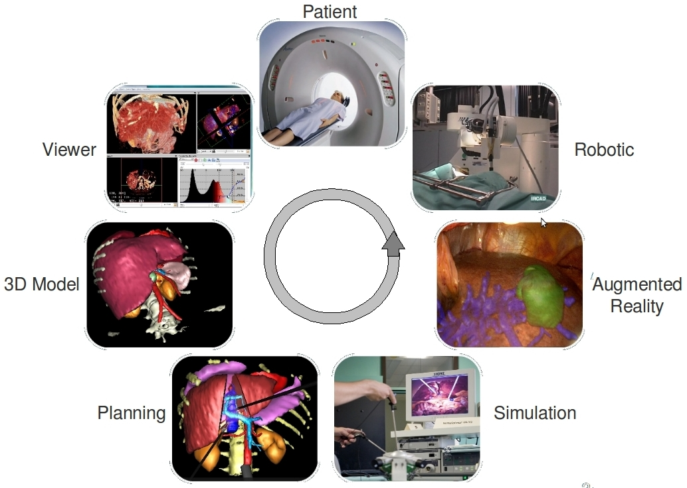

:title: Basic example
:data-transition-duration: 1250
:author: Flavien Bridault
:description: Basic hovercraft example
:keywords: presentation
:css: css/presentation.css
:skip-help: true

----

:id: circle-no-background

|
|
|
|

FW4SPL, a framework for applications based on medical imaging. 
==================================================================

|
|

**Flavien Bridault**

*RMLL 2015, Beauvais, Wednesday, 8th 2015*

----

:data-rotate-z: 90

Outline
==================================================================

- *Introduction*
- Object/Service approach
- Component based approach
- Framework features
- Community

----

:data-y: r2000

Introduction
==================================================================

Presentation purpose : 
________________________
- Understand why we have developed FW4SPL
- Show the main features available
- Help to start developping

----

IRCAD context
=================

----

:data-y: r2000

IRCAD R&D team
=================

- Researchers
- Engineers
- Trainees/Students
- Phd. students

----

:data-y: r2000

IRCAD R&D needs
=================

- Quick development/prototyping on different plaforms
- Maximal source code re-using
- Trainees/phd (students) works integrated but fragmented
- Facilitate collaborations (source code available or not)

.. note::

    - software/prototype - Windows, OSX, Linux, Android, IOs
    - sample with image filter, something...
    
----

:data-rotate-x: 45
:data-scale: 2
:data-y: r3000

Video integration test
===============================

.. raw:: html

       <video width="800" height="600" controls>
          <source src="ogre.mp4" type="video/mp4">
          Your browser does not support the video tag.
       </video> 

----

:data-x: -1000
:data-scale: 1/2

That's all folks!
=================

