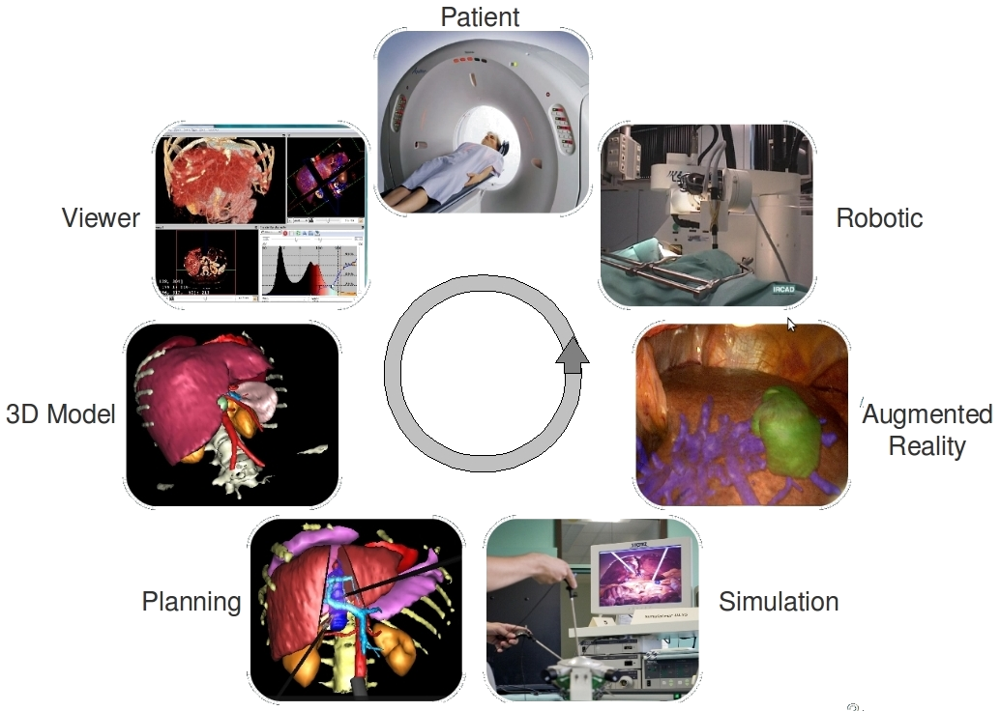

:title: Basic example
:data-transition-duration: 1250
:author: Flavien Bridault
:description: Basic hovercraft example
:keywords: presentation
:css: css/presentation.css
:skip-help: true

.. role:: main-color
.. role:: big-bold
.. role:: bold-color
.. role:: big-bold-color
.. role:: funny-font

.. role:: mail

----

:id: circle-no-background

|
|
|

FW4SPL, a framework for applications based on medical imaging. 
==================================================================

|

**Flavien Bridault**

*RMLL 2015, Beauvais, Wednesday, 8th 2015*

----

:data-y: r1500
:data-rotate-z: 90

Presentation purpose : 
==================================================================

- Why IRCAD R&D team has developed FW4SPL ?
- Explain the design
- Show the main features
- Help to start developing

----

:data-y: r1500

Outline
==================================================================

- *Introduction*
- Object/Service approach
- Component based approach
- Framework features
- Community

.. note::

    - Introduction - 5min
    - Object/Service approach - 10 min
    - Component based approach - 5min
    - Framework features -5min 
    - Community - 10min
    - Conclusion - 5min

----

:id: ircad-context
:data-y: r2000

IRCAD context
=================

----

:data-x: r50
:data-scale: 0.4

----

:data-x: r-50
:data-y: r-150

----

:data-x: r-100

----

:data-x: r-100
:data-y: r50

----

:data-y: r150

----

:data-x: r100
:data-y: r100

----

:data-x: r100

----

:data-x: r-50
:data-y: r-100
:data-scale: 1

----

:data-y: r1500

IRCAD R&D team
=================

- Researchers (3)
- Engineers (7)
- Phd. students (3)
- Trainees (6)
- Internships (4)

----

IRCAD R&D needs
=================

- Quick development/prototyping on different plaforms
- Maximal source code re-using
- Intensive use of open source libraries (boost, Qt, VTK, ITK,...) 
- Trainees/phd (students) works integrated but fragmented
- Facilitate collaborations (source code available or not)

.. note::

    - software/prototype - Windows, OSX, Linux, Android, IOs
    - sample with image filter, something...
    
----

FW4SPL characteristics
===========================

- Object/services design
- Component based
- Developed in C++
- Applications built in XML
- Multi platforms
- Depends on many open source libraries: boost, Qt, VTK, ITK, gdcm, libxml2,...

----

FW4SPL history
=================

- 2004-2007 : fw4spl project
- 2007-2009 : **VRRender** 0.7 (free)
- 09/2009 : fw4spl became open-source (LGPL)
- 2010 : PoC **Sofa** (Altran-Est), VRRender WLE 0.8.1 (free)
- 2011 : PoC **Kinect** (Altran-Est), VRRender 0.9 (open)
- 2012 : Introduction of multithreading
- 2013 : Creation of a board (*IRCAD*, *IHU*, *Visible Patient*) to manage the evolution of fw4spl

----

:data-x: r-580

- 2013 : Creation of fw4spl external repository (for branch 0.9.1 and after)
- 2014 : Switch to **CMake** for building
- 2014 : Creation of **GitHub** and **Bitbucket** repositories
- 2014 : Partial **Android** support
- 2015 : Documentation generated on **ReadTheDocs.org**
- 2015 : Creation of a blog for developers

.. note::

    - VRRender: mesh/image viewer - mettre une image !

----

:data-y: r1500

FW4SPL statistics
=============================

- Applications: 35 (PoC and Tutorials)
- Bundles: 52 (57 on private repository)
- Service number: 230 (380)
- Code line numbers: 220 000

----

:data-x: r1500
:data-rotate-z: r90

Outline
==================================================================

- Introduction
- *Object/Service approach*
- Component based approach
- Framework features
- Community

.. note::

    - Introduction - 5min
    - Object/Service approach - 10 min
    - Component based approach - 5min
    - Framework features - 10min 
    - Community - 5min
    - Conclusion - 5min

----

:data-x: r1500

What is the Object/Service approach ?
==================================================================

----

:data-x: r1500

Classic approach
====================

- an object (i.e. an image) is represented by a class.
- this class contains all functionalities working on the object (reading, writing, visualization,image analysis, ...)

----

:id: center1
:data-y: r500
:data-scale: 0.45

.. image:: images/Image.png
           :width: 80%

----

:id: center2
:data-y: r300

       
----

:data-y: r200
:data-scale: 1

|
|
|

.. code:: c++

    void readImageFromPacsWithDcmtk( ... )
    {
        // Code to load an image using dcmtk
        Dcmtk::Image img;
        
        // ...

        // Code to convert dcmtk image data in our own format
        m_buffer = dcmtkHelper::getBuffer( img );
        m_size = dcmtkHelper::getSize( img );
    }
    
----

:id: center3
:data-scale: 0.45
:data-x: r1000
:data-y: r-200

.. image:: images/Image02.png
           :width: 80%

----

:data-y: r200
:data-scale: 1

|
|
|

.. code:: c++

    void cropImageWithItk( ... )
    {
        // Code to convert our data to an itk image
        Itk::Image imgIn = itkHelper::getItkImage( m_buffer, m_size );

        // Code using library itk to crop an img
        // ...

        // Code to convert itk image data in our data
        m_buffer = itkHelper::getBuffer( imgOut );
        m_size = itkHelper::getSize( imgOut );
    }

----

:id: center4
:data-scale: 0.45
:data-x: r1100
:data-y: r-200

.. image:: images/Image04.png
           :width: 80%

----

:data-scale: 1
:data-y: r200

|
|
|

.. code:: c++

    void visuWithVtkAndQt( ... )
    {
        // Code to convert our data to a vtk image
        Vtk::Image img = vtkHelper::getVtkImage( m_buffer, m_size );

        // Code using library vtk and Qt to
        // open a Qt frame and show a negato
    }

----

:data-scale: 0.9
:data-y: r-350

.. code:: c++

    Image* img = new Image();
    img->readFromPacsWithDcmtk( patientInfo, pacsInfo );
    img->cropWithItk( cropParam );
    img->visuWithVtkAndQt( visuParam );

|
|
|

----

:data-x: r1500

Limits of this approach
============================================================

- Too many methods in the class, hard to maintain 
- Many dependencies required even if you only need a single method.
- Collaborative work harder

Solution
***********
- Split data and functions
- Put them in different files and libraries

.. note::

    - Too many functions, if team continue to add functions or if you split your main functions to have a better visibility
    - Many dependencies required (itk,vtk,qt,dcmtk,...) even if you need just cropping an image
    - Everyone work on the same file

----

:id: center5
:data-scale: 0.7
:data-x: r1000
:data-y: r-200

*Object contains data only*

*Helpers are static methods*

.. image:: images/helper01.png
           :width: 100%

----

:data-y: r200
:data-scale: 1

|
|
|

.. code:: c++

    Image * img = new Image ();
    DcmtkHelper :: readFromPacs ( img , patientInfo , pacsInfo );
    ItkHelper :: crop ( img , cropParam );
    CImgHelper :: window ( img , windowParam );
    VtkQtHelper :: visu ( img , visuParam );

----

:data-y: r1500
:data-rotate-z: r90

Outline
==================================================================

- *Introduction*
- Object/Service approach
- Component based approach
- Framework features
- Community

.. note::

    - Introduction - 5min
    - Object/Service approach - 10 min
    - Component based approach - 5min
    - Framework features -5min 
    - Community - 10min
    - Conclusion - 5min
    
----

:data-rotate-x: 45
:data-scale: 2
:data-y: r3000

Demonstration
===============================

.. raw:: html

       <video width="800" height="600" controls>
          <source src="ogre.mp4" type="video/mp4">
          Your browser does not support the video tag.
       </video> 

