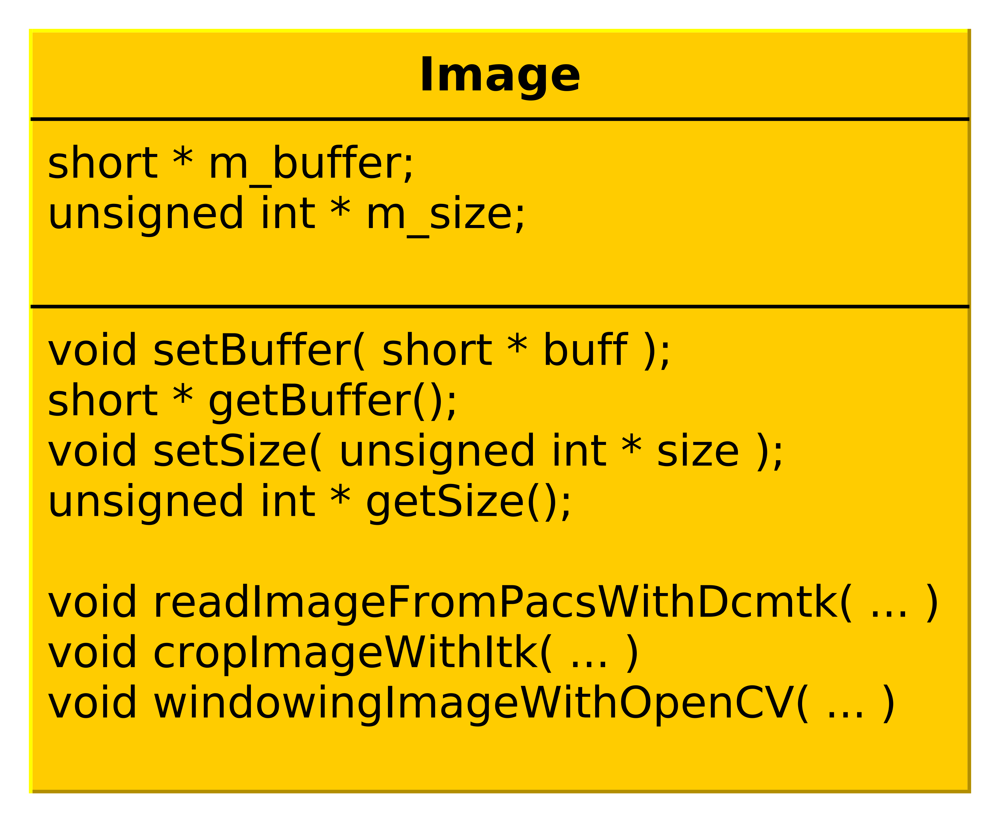

:title: Basic example
:data-transition-duration: 1250
:author: Flavien Bridault
:description: Basic hovercraft example
:keywords: presentation
:css: css/presentation.css
:skip-help: true

.. role:: main-color
.. role:: big-bold
.. role:: bold-color
.. role:: big-bold-color
.. role:: funny-font

.. role:: mail

----

:id: circle-no-background

|
|
|

FW4SPL, a framework for applications based on medical imaging. 
==================================================================

|

**Flavien Bridault**

*RMLL 2015, Beauvais, Wednesday, 8th 2015*

----

:data-y: r1500
:data-rotate-z: 90

Presentation purpose : 
==================================================================

- Why IRCAD R&D team has developed FW4SPL ?
- Explain the design
- Show the main features
- Help to start developing

----

:class: square-background
:data-y: r1500

Outline
==================================================================

- *Introduction*
- Object/Service approach
- Component based approach
- Framework features
- Community

.. note::

    - Introduction - 5min
    - Object/Service approach - 10 min
    - Component based approach - 5min
    - Framework features -5min 
    - Community - 10min
    - Conclusion - 5min

----

:id: ircad-context
:data-y: r2000

IRCAD context
=================

.. image:: images/patient.png 
           :width: 30%

----

:data-x: r-300
:data-y: r-300
:data-scale: 0.4

.. raw:: html

       
Viewer

       <video width="800" height="600">
          <source src="../git/RMLL/videos/VRMedNegato2D3D.mp4" >
          Your browser does not support the video tag.
       </video>

----

:data-x: r-270
      

.. raw:: html

       
Segmentation/3D models

       <video width="800" height="600">
          <source src="../git/RMLL/videos/TeaserVisiblePatient2012.mp4" >
          Your browser does not support the video tag.
       </video>
           
----

:data-x: r-270
:data-y: r300

.. raw:: html

       
Planning

       <video width="800" height="600">
          <source src="../git/RMLL/videos/TeaserVisiblePatient2012.mp4" >
          Your browser does not support the video tag.
       </video>
       
----

:data-x: r270
:data-y: r300

.. raw:: html

       
Simulation

       <video width="800" height="600">
          <source src="../git/RMLL/videos/digitalTrainersSimu1.mov" >
          Your browser does not support the video tag.
       </video>
       
       
----

:data-x: r270

.. raw:: html

       
Augmented reality

       <video width="800" height="600">
          <source src="../git/RMLL/videos/rdARinteractive1.mov" >
          Your browser does not support the video tag.
       </video>
       
----

:data-x: r-200
:data-y: r-300
:data-scale: 1.2

----

:data-y: r1500

IRCAD R&D team
=================

.. image:: images/team.jpg
           :width: 80%

- Researchers (3)
- Engineers (7)
- Phd. students (3)
- Trainees (6)
- Internships (4) 
   
----

IRCAD R&D needs
=================

- Quick development/prototyping on different plaforms
- Maximal source code re-using
- Intensive use of open source libraries (boost, Qt, VTK, ITK,...) 
- Trainees/phd (students) works integrated but fragmented
- Facilitate collaborations (source code available or not)

.. note::

    - software/prototype - Windows, OSX, Linux, Android, IOs
    - sample with image filter, something...
    
----

FW4SPL characteristics
===========================

- Object/services design
- Component based
- Developed in C++
- Applications built in XML
- Multi platforms (Windows, Linux, OSX, Android)
- Depends on many open source libraries: boost, Qt, VTK, ITK, gdcm, dcmtk, libxml2,...
- Licensed under LGPL

----

FW4SPL history
=================

- 2004-2007 : fw4spl project
- 2007-2009 : **VRRender** 0.7 (free)
- 09/2009 : fw4spl became open-source (LGPL)
- 2010 : PoC **Sofa** (Altran-Est), VRRender WLE 0.8.1 (free)
- 2011 : PoC **Kinect** (Altran-Est), VRRender 0.9 (open)
- 2012 : Introduction of multithreading
- 2013 : Creation of a board (*IRCAD*, *IHU*, *Visible Patient*) to manage the evolution of fw4spl

----

:data-x: r-700

- 2013 : Creation of fw4spl external repository (for branch 0.9.1 and after)
- 2014 : Switch to **CMake** for building
- 2014 : Creation of **GitHub** and **Bitbucket** repositories
- 2014 : Partial **Android** support
- 2015 : Documentation generated on **ReadTheDocs.org**
- 2015 : Creation of a blog for developers

.. note::

    - VRRender: mesh/image viewer - mettre une image !

----

:data-y: r1500

FW4SPL board
=================

- IRCAD `<http://www.ircad.fr>`_
- IHU  `<http://www.ihu-strasbourg.eu>`_
- Visible Patient `<http://www.visiblepatient.com>`_

----

:data-y: r1500

FW4SPL statistics
=============================

UPDATE THAT

- Applications: 35 (PoC and Tutorials)
- Bundles: 52 (57 on private repository)
- Service number: 230 (380)
- Code line numbers: 220 000

----

:class: square-background
:data-x: r1500
:data-rotate-z: r90

Outline
==================================================================

- Introduction
- *Object/Service approach*
- Component based approach
- Framework features
- Community

.. note::

    - Introduction - 5min
    - Object/Service approach - 10 min
    - Component based approach - 5min
    - Framework features - 10min 
    - Community - 5min
    - Conclusion - 5min

----

:data-x: r1500

What is the Object/Service approach ?
==================================================================

----

:data-x: r1500

Classic approach
====================

- an object (i.e. an image) is represented by a class.
- this class contains all functionalities working on the object (reading, writing, visualization,image analysis, ...)

----

:class: centered
:data-y: r500
:data-scale: 0.45

.. image:: images/Image.png
           :width: 80%

----

:class: centered
:data-y: r300

.. image:: images/Image01.png
           :width: 80%
       
----

:data-y: r200
:data-scale: 1

|
|
|

.. code:: c++

    void readImageFromPacsWithDcmtk( ... )
    {
        // Load an image using dcmtk
        Dcmtk::Image img;
        
        // ...

        // Convert dcmtk image data in our format
        m_buffer = dcmtkHelper::getBuffer(img);
        m_size = dcmtkHelper::getSize(img);
    }
    
----

:class: centered
:data-scale: 0.45
:data-x: r1100
:data-y: r-200

.. image:: images/Image02.png
           :width: 80%

----

:data-y: r220
:data-scale: 1

|
|
|

.. code:: c++

    void cropImageWithItk( ... )
    {
        // Convert our data to an itk image
        Itk::Image imgIn = itkHelper::getImage(m_buffer, m_size);

        // Crop an img using library itk 
        // ...

        // Convert itk image data in our format
        m_buffer = itkHelper::getBuffer(imgOut);
        m_size = itkHelper::getSize(imgOut );
    }

----

:class: centered
:data-scale: 0.45
:data-x: r1300
:data-y: r-200

----

:data-y: r220
:data-scale: 1

|
|
|

.. code:: c++

    void windowingImageWithOpenCV( ... )
    {
        // Convert our data to a OpenCV image
        OpenCV::Image imgIn = openCVHelper::getImage(m_buffer, m_size);

        // Apply windowing using OpenCV
        // ...

        // Convert openCV image data in our format
        m_buffer = openCVHelper::getBuffer(imgOut);
        m_size = openCVHelper::getSize(imgOut);
    }

----

:class: centered
:data-scale: 0.45
:data-x: r1400
:data-y: r-200

.. image:: images/Image04.png
           :width: 80%

----

:data-scale: 1
:data-y: r200

|
|
|

.. code:: c++

    void visuWithVtkAndQt( ... )
    {
        // Convert our data to a vtk image
        Vtk::Image img = vtkHelper::getVtkImage(m_buffer, m_size);

        // Open a Qt frame and show a negato using vtk and Qt
    }

----

:data-scale: 0.7
:data-y: r-350

.. code:: c++

    Image* img = new Image();
    img->readFromPacsWithDcmtk( patientInfo, pacsInfo );
    img->cropWithItk( cropParam );
    img->windowingImageWithOpenCV( windowParam );
    img->visuWithVtkAndQt( visuParam );

|
|
|

----

:data-x: r1500

Limits of this approach
============================================================

- Too many methods in the class, hard to maintain 
- Many dependencies required even if you only need a single method.
- Collaborative work harder

Solution
***********
- Split data and functions
- Put them in different files and libraries

.. note::

    - Too many functions, if team continue to add functions or if you split your main functions to have a better visibility
    - Many dependencies required (itk,vtk,qt,dcmtk,...) even if you need just cropping an image
    - Everyone work on the same file

----

:class: centered
:data-scale: 1
:data-x: r1000
:data-y: r-200

*Object contains data only*

*Helpers are static methods*

.. image:: images/helper01.png
           :width: 120%

----

:data-y: r200
:data-scale: 1

|
|
|

.. code:: c++

    Image* img = new Image();
    DcmtkHelper::readFromPacs(img, patientInfo, pacsInfo);
    ItkHelper::crop(img, cropParam);
    OpenCVHelper::window(img , windowParam);
    VtkQtHelper::visu(img, visuParam);

----

:class: centered
:data-scale: 1
:data-x: r1500
:data-y: r-200

*Helpers can be instantiated*

.. image:: images/helper02.png
           :width: 120%

----

:data-y: r300
:data-scale: 1

|
|
|

.. code:: c++

    Image* img = new Image();
    VtkQtHelper* visuHelper = new VtkQtHelper();
    visuHelper->initVisu(img, visuParam);
    
    DcmtkHelper::readFromPacs(img, patientInfo, pacsInfo);
    visuHelper->refresh();
    
    ItkHelper::crop(img, cropParam);
    visuHelper->refresh();
    
    OpenCVHelper::window(img, windowParam);
    visuHelper->refresh();
    
    
    
----

:class: centered
:data-scale: 0.8
:data-x: r1500
:data-y: r-200

*Group helpers by type*

.. image:: images/helper03.png
           :width: 130%

----

:data-y: r530
:data-scale: 1

|
|
|

.. code:: c++

    Image* img = new Image();
    
    IVisu * visu = new VtkQtVisu();
    visu->setVisuParam(img, visuParam );
    visu->init();
    
    IReader* reader = new DcmtkReader();
    reader->setReaderParam(img, patientInfo, pacsInfo );
    reader->read();
    
    IOperator* op1 = new ItkCropOperator();
    op1->setOperatorParam(img, cropParam);
    op1->compute();
    visu->refresh();
    
    IOperator* op2 = new OpenCVWindowOperator();
    op2->setOperatorParam(img, windowParam);
    op2->compute();
    visu->refresh();
    
----

:class: centered
:data-scale: 0.8
:data-x: r1500
:data-y: r-200

*Common interface for all services*

.. image:: images/IService01.png
           :width: 60%

----

:class: li1
:data-y: r380
:data-scale: 1

- setObject(obj) : set the object associated
- setConfiguration(cfg) : set the service parameters
- configure() : verify parameters and configure service
- start() : init/launch the service
- update() : compute data, refresh, etc
- stop() : close the service

----

:class: centered
:data-scale: 1
:data-x: r1500
:data-y: r-200

*Group helpers by type*

.. image:: images/IService02.png
           :width: 120%
       
----

:data-scale: 0.18
:data-x: r-50
:data-y: r350

DcmtkReaderSrv
================
    
- setConfiguration(cfg) : set a string that represents the url on network
- configure() : verifies if url is ok
- start() : do nothing
- update() : read the data ( equivalent to **readImageFromPacsWithDcmtk()** )
- stop() : do nothing

----

:data-x: r165

ItkCropOperatorSrv
===================
    
- setConfiguration(cfg) : set a cropping region
- configure() : verifies if the cropping region is valid
- start() : do nothing
- update() : compute the cropping on image and set the new data (equivalent to **cropImageWithItk** )
- stop() : do nothing

----

:data-x: r360

VtkQtVisuSrv
===================
    
- setConfiguration(cfg) : set title and window size
- configure() : verifies if the screen support this size
- start() : initialize Qt frame and vtk pipeline and show the frame (image is not shown if image buffer is null )
- update() : check if the buffer has be changed, if true, refresh the vtk pipeline to show negato
- stop() : destroy vtk pipeline and uninitialize Qt frame.

----

:class: square-background
:data-y: r1500
:data-rotate-z: 90

Outline
==================================================================

- Introduction
- Object/Service approach
- *Component based approach*
- Framework features
- Community

.. note::

    - Introduction - 5min
    - Object/Service approach - 10 min
    - Component based approach - 5min
    - Framework features -5min 
    - Community - 10min
    - Conclusion - 5min
    
----

:data-y: r1500

Component
===========
- blabla
- blablablba

----

:class: square-background
:data-y: r1500
:data-rotate-z: 180

Outline
==============================

- Introduction
- Object/Service approach
- Component based approach
- *Framework features*
- Community

.. note::

    - Introduction - 5min
    - Object/Service approach - 10 min
    - Component based approach - 5min
    - Framework features -5min 
    - Community - 10min
    - Conclusion - 5min
    
    
----

:data-x: r-1500

Visualization
===================

- Negato 2D/3D
- Generic scene

----

:class: square-background
:data-y: r-10500
:data-rotate-z: 270

Outline
==================================================================

- Introduction
- Object/Service approach
- Component based approach
- Framework features
- *Community*

.. note::

    - Introduction - 5min
    - Object/Service approach - 10 min
    - Component based approach - 5min
    - Framework features -5min 
    - Community - 10min
    - Conclusion - 5min
    
----

:data-y: r-1500

Where can I find documentation ?
========================================

- Documentation `<http://fw4spl-doc.readthedocs.org/>`_
- Developper blog `<http://fw4spl-org.github.io/fw4spl-blog/>`_ 

----

Where can I download FW4SPL ?
==============================

- Github : `<https://github.com/fw4spl-org>`_
- BitBucket : `<https://bitbucket.org/fw4splorg>`_
- Do not use the obsolete googlecode page `<https://code.google.com/p/fw4spl/>`_ 

----

Which version to use ?
=========================

Current stable version
**************************
- 0.10.1

Current development version
******************************
- 0.10.2
- Strongly advised for new software (communication API is simpler)
- For now need patches repositories, only available on bitbucket

.. code:: bash

    hg qclone https://bitbucket.org/fw4splorg/fw4spl-patches

----

Repositories
================

Dependencies
*************

- Main : *fw4spl-deps*
- Extended : *fw4spl-deps-ext*
- Augmented reality : *fw4spl-deps-ar*

Sources
*************

- Main : *fw4spl*
- Extended : *fw4spl-ext*
- Augmented : *fw4spl-ar*

----

Main repository
================

- Basic data (Float, Integer, String, Image, Mesh,... )
- data I/O (JSON, DICOM (gdcm), VTK)
- 2D rendering (Qt)
- 3D rendering (VTK)
- Tutorials (VIDEO)
- VRRender (VIDEO)

----

Extended repository
=====================

- Timeline data
- data I/O (DICOM (dcmtk))

----

Augmented reality repository
=============================

- Video player (**QtMultimedia**): file, camera or network
- Tag-based video tracking (**Aruco**, **OpenCV**)
- *ARCalibration* : Camera calibration (VIDEO)
- *VideoTracking* : Video tracking (VIDEO)

.. note::
    - VideoTracking requires a calibration

----

Repositories
================

In September 2015
**************************

- Ogre3D integration : *fw4spl-Ogre3d*

