:title: Enhancement of augmented-reality visualization in surgery
:data-transition-duration: 1250
:author: Flavien Bridault
:description: Enhancement of augmented-reality visualization in surgery
:keywords: presentation
:css: css/presentation.css
:skip-help: true

----

:id: circle-no-background

|
|
|
|

Enhancement of augmented-reality visualization in surgery.
============================================================

**Flavien Bridault**

*Fellow meeting - Strasbourg, 18th September 2016*

----

:data-x: r0
:data-y: r2700
:data-rotate-z: 90
:class: text-small

Few words about me
====================

Background
*******************
- Phd. Thesis in Computer Graphics (2007)
- Senior programmer in the Video games industry (2008-2013)
    - Low-level programming
    - Graphics programming
    - XBox360, PS3, PC

Research engineer at IRCAD (2014)
***************************************
- Application development (**3DSurg**, **Lasar**, **Dosimap**)
- FW4SPL (in-house software framework) enhancements, focus on simplicity and productivity
- Graphics programming

----

Augmented-reality
==================

Add virtual information on top of reality
*********************************************

- Video stream + 3D scene on a screen
- Glasses + 3D scene through transparent screen

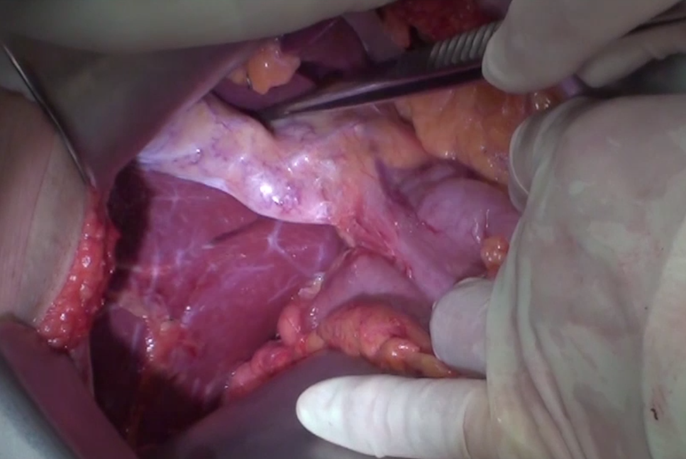

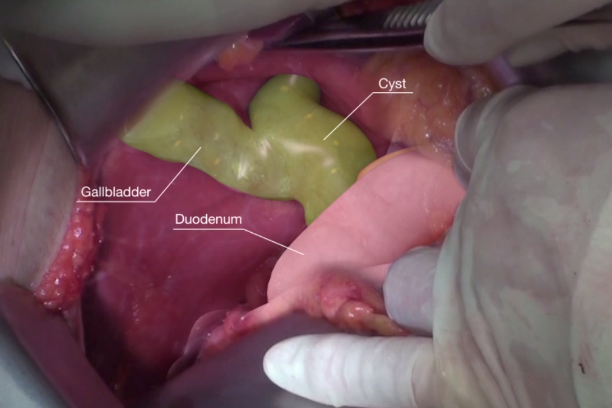

----

:data-x: r-150
:data-y: r0
:data-scale: 0.5

----

:data-x: r0
:data-y: r1500
:data-scale: 1.0

Context
==============

- IRCAD R&D team engaged in AR software (**3DSurg**, **Lasar**, **Dosimap**)
- Historically and still today, the focus is:
    - Segmentation
    - Registration
    - Tracking
    - Deformation
- So far, few work on visualization !

----

Visualization
==============

Previous work
****************
- Our rendering backend was outdated
- We have worked last two years to get a modern renderer

Now start the real interesting work !
*******************************************

- Improve the rendering algorithm of our software
- 1-year end-of-studies project of a student (Florent Nuttens) (**3DSurg**)
- Work package planned on **Lasar2**

----

Our plans so far...
=================================================

1. Compositing
****************************************
2. Shading
******************************
3. Annotations
*********************
4. ...
***********

----

:class: square-background

|

.. image:: images/we_need_you.jpg
           :width: 30%

We need you !
**************

----

1/ Compositing
========================================

- How to mix virtual data/information with real-world ?

.. raw:: html

    

    <iframe width="560" height="315" src="https://www.youtube.com/embed/uVDxMr-47kU?t=5m26s" frameborder="0" allowfullscreen></iframe>
    

----

1/ Compositing
========================================

- Improve ghosted-views with focus layers :

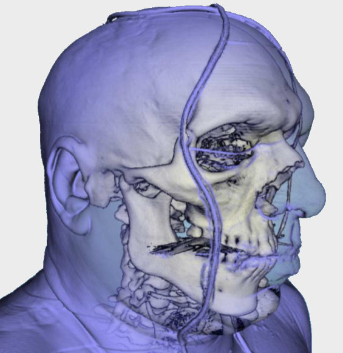

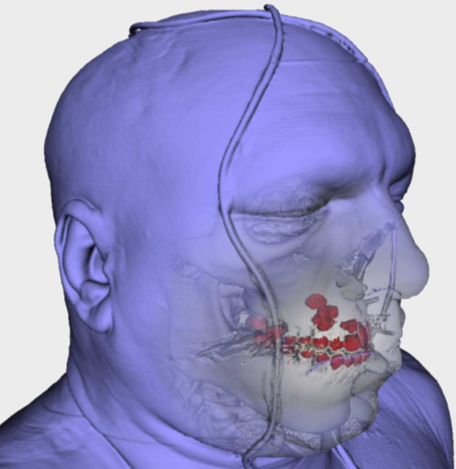

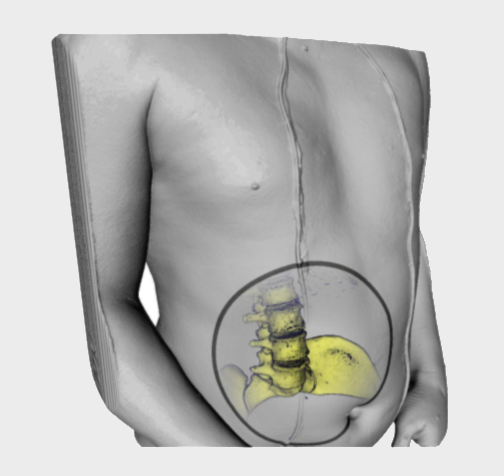

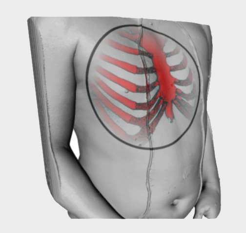

.. raw:: html

    

    ClearView:An Interactive Context Preserving Hotspot Visualization Technique, Jens Krüger et al., 2005
    

----

1/ Compositing
========================================

- Improve ghosted-views with focus layers :

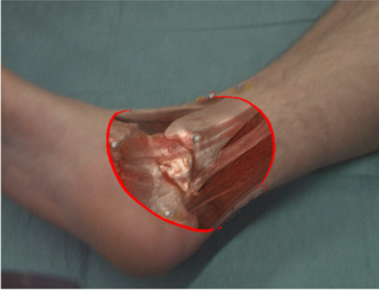

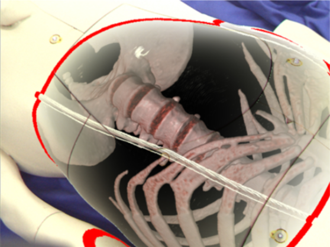

- Hand occlusions

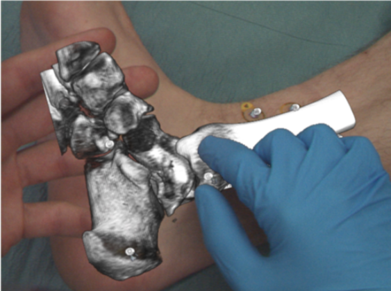

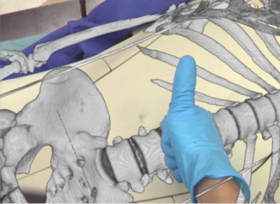

.. raw:: html

    

    Real-time Volume Rendering for High Quality Visualization in Augmented Reality, Kutter et al., 2008
    

----

1/ Compositing
========================================

- Tests on ARBreathing :

.. raw:: html

       <video width="640" height="480" controls>
          <source src="../git/fellowMeeting_20160915/videos/arbreathing-visu.mp4" >
          Your browser does not support the video tag.
       </video>

----

1/ Compositing
========================================

- Cut-away views :

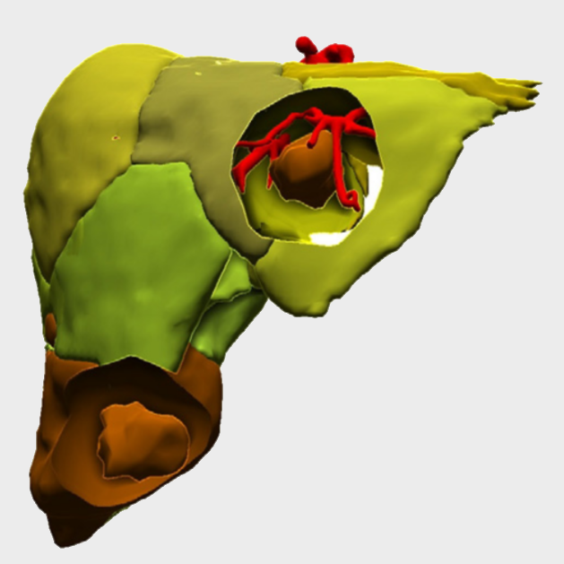

----

:data-x: r-800
:data-y: r0

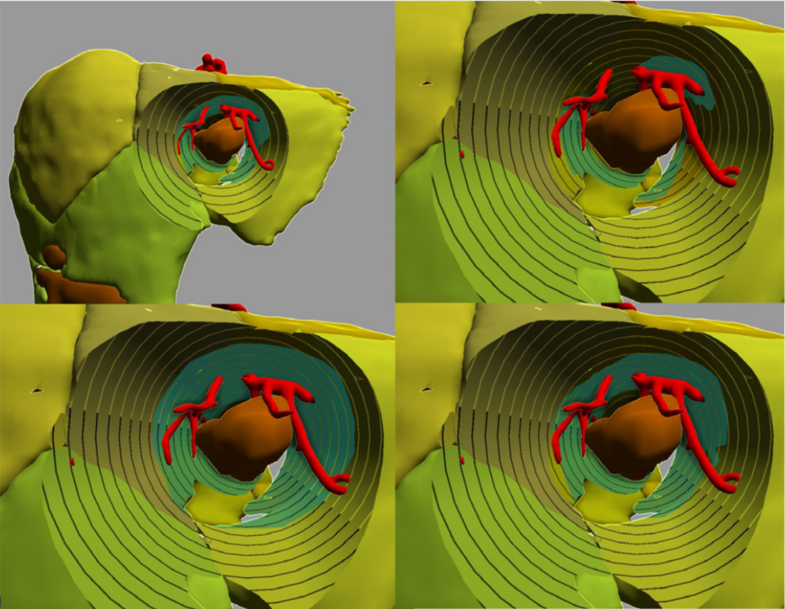

.. raw:: html

    

    GPU-based Smart Visibility Techniques for Tumor Surgery Planning, Kubisch et al., 2010
    

----

1/ Compositing
========================================

Stereoscopy ?
*****************

- Use Storz stereo endoscopes and 3D displays (**Lasar2**)

----

:data-x: r0
:data-y: r1500

2/ Shading
=================================================

Surfacic meshes
*****************

- Need a segmentation step
- Well-suited for GPUs (only triangles !)
- Nice interfaces, helpful to apply deformations
- Lot of room for improvement

----

2/ Shading
=================================================

Surfacic meshes rendering
***************************

- Use different illumination models
- Rather look at non-photorealistic techniques

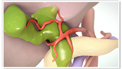

`The Toronto Video Atlas of Liver, Pancreas and Transplant Surgery <http://pie.med.utoronto.ca/TVASurg/TVASurg_content/surg/PB_typeICholeCyst.html>`_

----

2/ Shading
=================================================

Surfacic meshes rendering
***************************

- Ambient occlusions

.. raw:: html

       <video width="640" height="480" controls>
          <source src="../git/fellowMeeting_20160915/videos/sao.mp4" >
          Your browser does not support the video tag.
       </video>

----

2/ Shading
=================================================

Direct volume rendering
**************************

- Raw images
- Classification of intensities into colors
- Used to be slow
- Not well adapted for GPUs before 2001
- Usually employed with static 3D images
- May be interesting for AR

----

2/ Shading
=================================================

Direct volume rendering
**************************

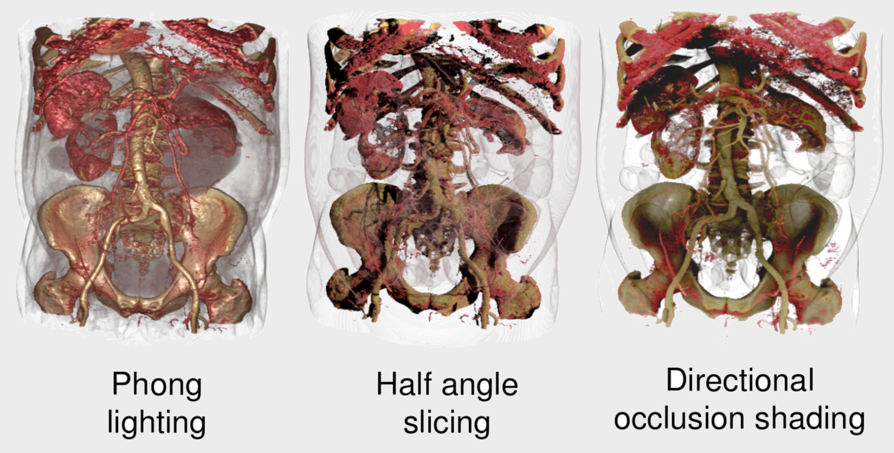

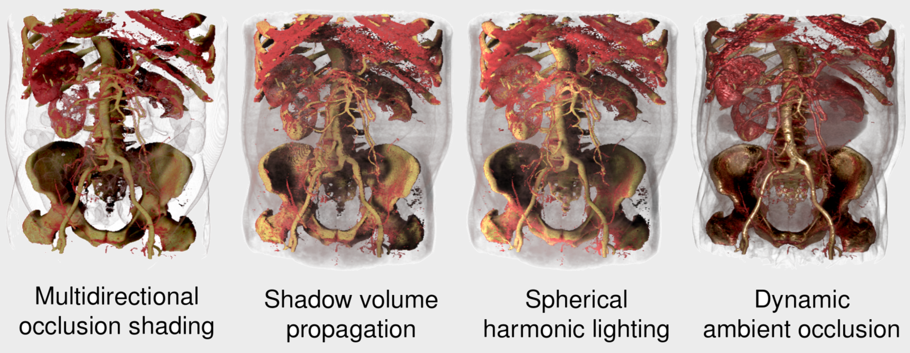

----

:data-x: r-100
:data-y: r0
:data-scale: 0.7

----

:data-x: r-700

.. raw:: html

    

    <iframe width="800" height="600" src="https://www.youtube.com/embed/703Zzl8YYJk" frameborder="0" allowfullscreen></iframe>
    

----

:data-x: r0
:data-y: r1500
:data-scale: 1.0

3/ Annotations
===================

- Structures of interest, vessels
- Interesting only for education ?

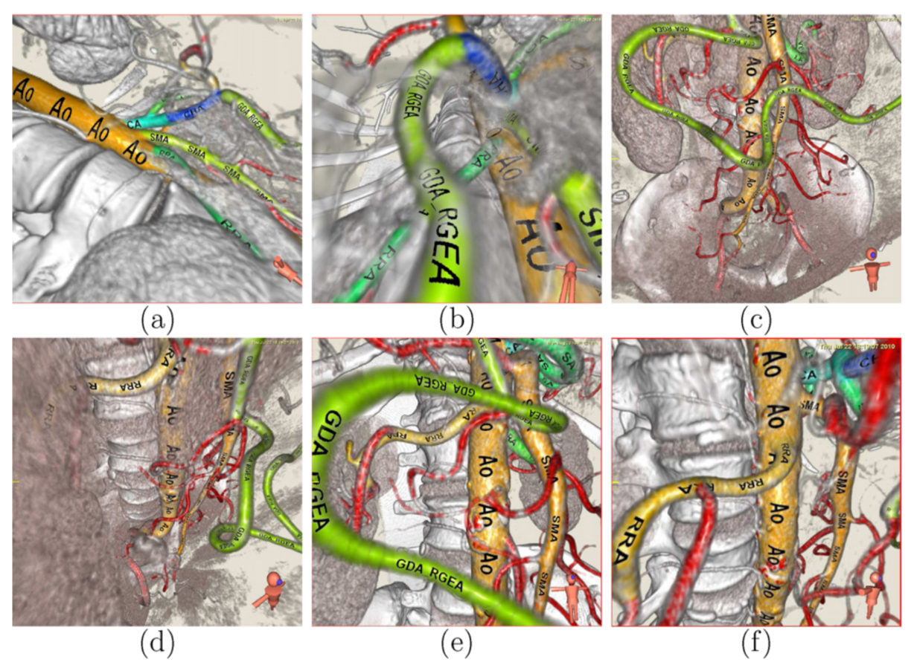

.. raw:: html

    

    Anatomical annotation on vascular structure in volume rendered images, Jiang et al., 2010
    

----

:data-rotate-z: 90
:data-x: r0
:data-y: r1500

Conclusion
===========================

- Lots of possibilities
    - Prioritize
    - Keep in mind we want to improve understanding
- Experiments
    - Need clinicians to make propositions
    - Need clinicians to validate
- Mix surface rendering and volume rendering

----

:class: centered
:data-y: r1500

Thank you !
=============

fw4spl at gmail.com

fbridault at ircad.fr

|
|

	Presentation made with Hovercraft_

.. _Hovercraft: https://github.com/regebro/hovercraft
